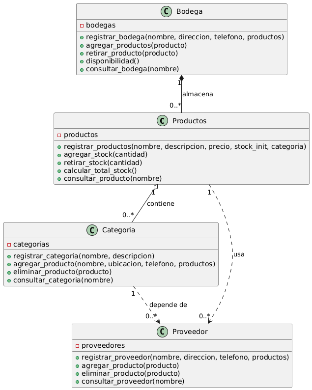

# Sistema de Gestión de Inventario: Leymar Buenaventura

## Diagrama uml



## Descripción
 **Sistema de Gestión de Inventario** es una aplicación diseñada para gestionar productos, categorías, proveedores y bodegas. Permite registrar y administrar estos elementos, gestionar el stock, y realizar consultas e informes relacionados con el inventario.

## Cómo Iniciar el Programa
1.**Clonar el repositorio**
   
Para ejecutar este programa, primero clonamos el repositorio usando git. Hay que tener git instalado y luego ejecutar este comando en la ruta donde queramos clonar el proyecto.
   ```bash
   git clone https://github.com/lebuas/Gestion-de-inventario
   ```

4.**Crear Entorno Virtual**

Hay que tener instalado venv, que es un entorno virtual para trabajar con python, si no lo tiene, instalarlo con el siguiente comando, para wsl(windows), debían, ubuntu, mint:

  ```bash
   sudo apt install python3-venv
  ```

Abrir una terminal y navegar hasta la ruta o directorio donde se clono el repositorio y luego, crear un entorno virtual con el siguiente comando:

   ```bash
   python3 -m venv entorno_virtual
   ```
  
Cando cree el entorno virtual tiene que activarlo,
si esta en wsl con con ubuntu o mint, use:
  ```bash
  entorno_virtual\bin\activate
  ```
Una vez activado el entorno virtual, ya podemos ejecutar el programa, en este caso no es necesario instalar requerimientos.
Para ejecutar el programa, ir al directorio donde se clono el proyecto y ejecutar el siguiente comando:

   ```bash
   python app.py
